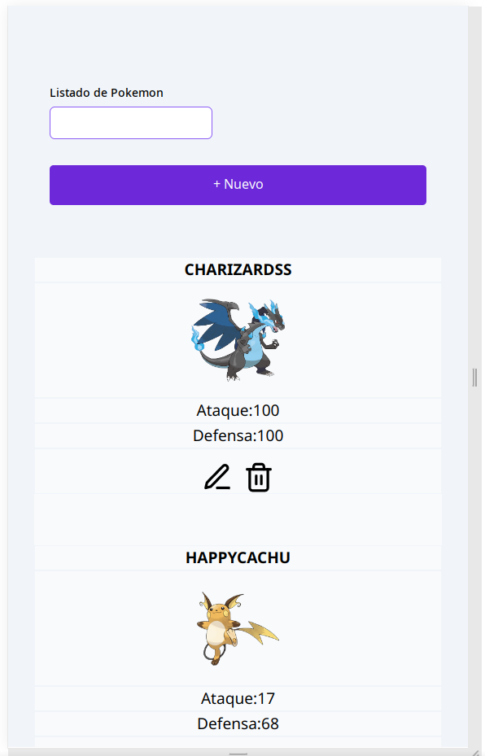

# POKEMON APP
instalar dependencias primero con `yarn add` o `npm install`
correr con `yarn dev`

### Importante:
Para correr el proyecto usando el servidor mock cambiar
VITE_USE_POKEMON_API_MOCK a true en el archivo .env que incluye
el proyecto.

Lost tests unitarios automáticamente corren con el mock

## Herramientas usadas:
### Vite
Se escogió Vite en vez de usar **Create React App** dado que CRA no se considera buena opción en producción y con
Vite se configura desde cero, eligiendo solo los paquetes necesarios

Todos los componentes son creados desde cero y lo único que reusé
fue mi [proyecto base](https://github.com/cocodrino/base_project_react_vite/tree/main/src)
que debo actualizarlo porque para este proyecto agregué muchos cambios y mejoras en el linter,
tailwind y MSW

### Redux Toolkit
Aunque por las dimensiones de la app no era tan necesario, ayuda a evitar el pasar callbacks a componentes
hijos y centraliza el storage en un solo sitio para que los componentes se conecten a él

### Tailwind
Aunque no tengo mucho tiempo usando tailwind considero que permite prototipar más rápido que en CSS clásico, aunque hubiese querido pasar los estilos a
CCS para que quedara más limpio el HTML. Aun así intenté colocar el plus de hacer el **diseño responsive** 

### Jest y MSW
Para realizar pruebas unitarias se realizó un mock de la API en MSW, lo que permite siempre tener los mismos
resultados y no tener que hacer peticiones de prueba a la API real

### OBSERVACIONES
Aunque no vi necesario usar **React Router** organicé los componentes en la carpeta *pages* porque es la
estructura que normalmente tendría usando React Router o NextJS y el componente principal se puede
visualizar como una página

### POSIBLES MEJORAS
- colocar id_author e idAuthor como variables en el .env
- mover estilos de tailwind a CSS
- colocar aviso para confirmar antes de borrar

